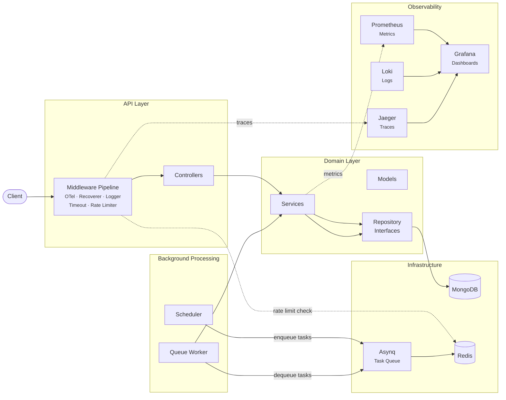

# Subscription Management Service

A production-grade Go backend for managing recurring subscriptions — with automated billing, renewal scheduling, and email notifications. Built to demonstrate clean architecture, distributed tracing, and resilient infrastructure patterns in a real-world context.

## Architecture at a Glance



> Domain services depend on **interfaces**, not implementations. MongoDB, Redis, and OTel are wired at the boundary — the business logic is infrastructure-agnostic.

## Key Engineering Decisions

| Pattern | What & Why |
|---|---|
| **Clean Architecture** | Strict layering — [domain models](internal/domain/models/) own validation, [services](internal/domain/services/) own business rules, [repositories](internal/domain/repositories/) define interfaces the infra implements. Domain never imports API or adapter packages. |
| **Fail-Open Rate Limiter** | Redis-backed per-IP rate limiting via [middleware](internal/api/middlewares/rate_limiter.go). If Redis dies, traffic **keeps flowing** — errors are recorded in the OTel span and log-throttled with `atomic.CompareAndSwap` to avoid log floods. |
| **Spoofing-Resistant IP Extraction** | [`ClientIP`](internal/lib/net.go) traverses `X-Forwarded-For` right-to-left to find the first public IP, ignoring headers entirely if `RemoteAddr` is already public. Uses `netip.ParseAddr` for validation with zero-allocation parsing. |
| **OTel Distributed Tracing** | End-to-end request traces from HTTP → Redis → MongoDB → transaction commit — all without polluting domain logic. Instrumentation lives at the [middleware](internal/api/middlewares/otel.go) and adapter boundaries. Trace context propagates across the Asynq queue via [W3C header injection](internal/observability/asynq.go). |
| **Transactional Billing** | Subscription creation and renewal atomically insert a bill + update the subscription inside a [MongoDB transaction](internal/domain/repositories/txn.go). The `TxnFn` type lets services run transactions without importing `mongo`. |
| **Clock Injection** | All services accept a [`clock.NowFn`](internal/core/clock/clock.go) — `time.Now` in production, a fixed timestamp in tests. Zero-cost testability without mocking the clock globally. |
| **Interface Segregation** | Service interfaces are split into [`External`](internal/domain/services/subscription.go#L17-L24) (API-facing) and [`Internal`](internal/domain/services/subscription.go#L26-L34) (scheduler/worker-facing). Each consumer depends only on the methods it needs. |
| **Structured Error System** | A typed [`AppError`](internal/api/shared/apperror/) system with error codes that map directly to HTTP status codes. Errors carry optional log attributes for contextual debugging without leaking internals to the client. |
| **Generic MongoDB Helpers** | Type-safe CRUD wrappers ([`FindOne[T]`](internal/lib/mongo.go), `FindMany[T]`, etc.) with unified error classification — duplicate key → Conflict, deadline exceeded → Timeout, no documents → NotFound. Written once, used by every repository. |
| **Background Task Pipeline** | A [scheduler](internal/scheduler/scheduler.go) polls for due subscriptions and enqueues tasks via Asynq into Redis. A [queue worker](internal/scheduler/worker.go) processes reminders, auto-renewals, and expirations — with deduplication, retries, and OTel trace propagation across the queue boundary. |
| **Graceful Shutdown** | Signal-driven shutdown coordinates HTTP drain, OTel flush, scheduler stop, worker stop, and database disconnect through a [composable `CleanupHandler` chain](internal/adapters/). |

## Observability

A single `POST /api/v1/subscriptions` request produces the trace below — showing the Redis rate-limit check (`evalsha`), MongoDB bill and subscription inserts, and the transaction commit, all correlated under one trace ID:

<p align="center">
  
</p>

The full observability stack — Jaeger, Prometheus, Loki, and Grafana — runs via a single Docker Compose file. See [docs/OBSERVABILITY.md](docs/OBSERVABILITY.md) for the deep dive on tracing, metrics, and structured logging.

## Quick Start

### Prerequisites

- **Go 1.26+**
- **MongoDB** (replica set required for transactions)
- **Redis**

### Run

```bash
# Clone
git clone https://github.com/AnuragThePathak/subscription-management.git
cd subscription-management

# Configure
cp example.yaml config.yaml
# Edit config.yaml with your MongoDB/Redis connection details

# Start the observability stack (optional)
docker compose -f docker-compose.observability.yml up -d

# Run the service
go run .
```

> [!NOTE]
> MongoDB must be running as a **replica set** for transaction support. The scheduler and queue worker are disabled by default in development — see `enabled_for_env` in [config](docs/CONFIGURATION.md).

## API Overview

The API uses JWT authentication (access + refresh tokens). All subscription and user endpoints require a valid access token.

| Group | Endpoints | Description |
|---|---|---|
| **Auth** | `POST /register`, `/login`, `/refresh` | User registration, login, token refresh |
| **Users** | `GET /users/:id`, `DELETE /users/:id` | Profile management (owner-only) |
| **Subscriptions** | `POST`, `GET`, `PUT /:id/cancel`, `DELETE /:id` | Full lifecycle management with auto-billing |
| **Health** | `GET /healthz`, `GET /readyz` | Liveness and readiness probes (checks MongoDB + Redis) |
| **Metrics** | `GET /metrics` | Prometheus scrape endpoint |

> **Runnable API examples** — see the [`.http` files](internal/api/http/) for ready-to-use requests in VS Code / IntelliJ HTTP client.

## Testing

The project uses a **two-tier testing strategy** that separates fast unit tests from infrastructure-dependent integration tests.

### Unit Tests

Table-driven tests with [mockery](https://github.com/vektra/mockery)-generated mocks. Services are tested with a `noopTxnFn` that executes transaction callbacks synchronously — no database needed.

```bash
make test          # Unit tests + coverage summary
```

### Integration Tests

Repository tests run against a **real MongoDB instance** spun up via [Testcontainers](https://testcontainers.com/). Each test gets an isolated database name, so tests share a single container without data interference.

```bash
make integration   # Integration tests only (requires Docker)
make test-all      # Unit + integration with race detector
```

### Coverage

```bash
make coverage      # Open HTML coverage report (run test or test-all first)
```

## Development

### Makefile Targets

| Target | Description |
|---|---|
| `make test` | Unit tests with coverage |
| `make integration` | Integration tests (requires Docker) |
| `make test-all` | All tests with race detector |
| `make coverage` | Open coverage HTML report |
| `make mocks` | Regenerate mockery mocks |
| `make vet` | Run `go vet` |
| `make lint` | Run `golangci-lint` |
| `make check` | Full pre-commit: vet + lint + all tests |
| `make build` | Build binary to `bin/app` |

### Configuration

Configuration is loaded from `config.yaml` (see [`example.yaml`](example.yaml)) with environment variable overrides via the `APP_` prefix. See [docs/CONFIGURATION.md](docs/CONFIGURATION.md) for details.

### Further Reading

| Document | Content |
|---|---|
| [Architecture](docs/ARCHITECTURE.md) | Layer design, service composition, background processing, graceful shutdown |
| [Testing](docs/TESTING.md) | Testing philosophy, pre-poisoning, vault lock verification, mutation prevention |
| [Observability](docs/OBSERVABILITY.md) | Distributed tracing, metrics, structured logging, running the stack |
| [Configuration](docs/CONFIGURATION.md) | All config options, env var overrides, validation rules |

## License

[MIT](LICENSE)
