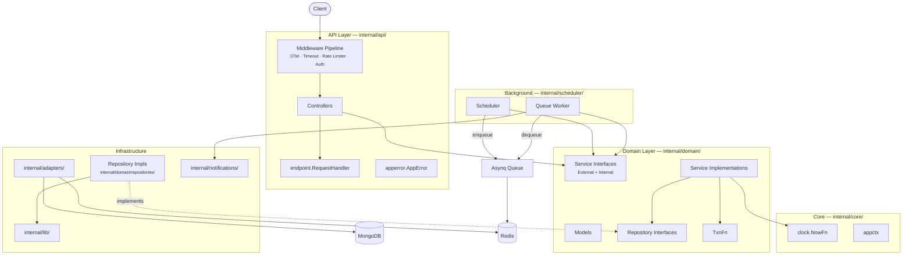
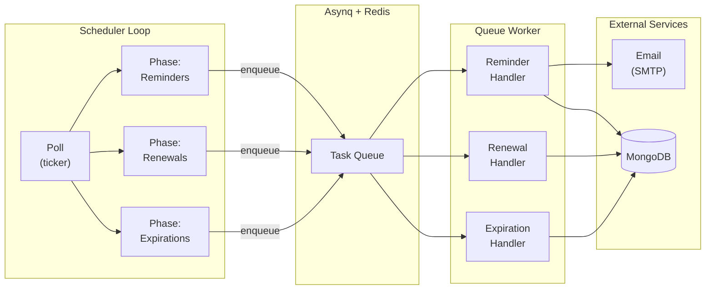

# Architecture

This document explains the structural design decisions behind the codebase — how layers interact, why interfaces are shaped the way they are, and how the background processing pipeline works.

For the observability story (tracing, metrics, logging), see [OBSERVABILITY.md](OBSERVABILITY.md).

---

## Layer Overview



**Dependency rule**: imports flow inward. Domain packages never import API or infrastructure packages. The API layer depends on domain interfaces, not concrete implementations.

---

## Domain Layer

### Models — [`internal/domain/models/`](../internal/domain/models/)

Pure data structures with self-validation. Each model has three forms:

| Form | Purpose | Example |
|---|---|---|
| **Model** (`Subscription`) | Database representation with BSON tags | Passed to repositories |
| **Request** (`SubscriptionRequest`) | API input with JSON + validator tags | Decoded from HTTP body |
| **Response** (`SubscriptionResponse`) | API output with JSON tags | Returned to clients |

Models own their own validation via `Validate()` methods. This means validation rules live with the data, not scattered across controllers or services.

```go
// Validation is a method on the model, not a separate validator
func (s *Subscription) Validate(now time.Time) error {
    if s.Name == "" || len(s.Name) < 2 || len(s.Name) > 100 {
        return apperror.NewValidationError("name must be between 2 and 100 characters")
    }
    // ...
}
```

> Note: `Validate()` accepts `now time.Time` rather than calling `time.Now()` internally. This makes validation deterministic in tests.

### Repository Interfaces — [`internal/domain/repositories/`](../internal/domain/repositories/)

Repository interfaces are defined **in the domain layer**, not in the infrastructure layer. This is an intentional departure from the typical "interfaces in the consumer" pattern — here the domain declares the contract, and the infrastructure fulfills it.

```go
type SubscriptionRepository interface {
    Create(context.Context, *models.Subscription) (*models.Subscription, error)
    GetByID(context.Context, bson.ObjectID) (*models.Subscription, error)
    GetSubscriptionsDueForRenewal(context.Context, time.Time, time.Time) ([]*models.Subscription, error)
    // ...
}
```

The implementations live in the same package (e.g., `subscriptionRepository` struct) because they're tightly coupled to the MongoDB query layer. Integration tests also live here, using [Testcontainers](https://testcontainers.com/) for real MongoDB instances.

### Transaction Abstraction — [`TxnFn`](../internal/domain/repositories/txn.go)

Services need to run multi-document transactions without importing `mongo`. The solution is a function type:

```go
type TxnFn func(ctx context.Context, fn func(ctx context.Context) error) error
```

The service receives `TxnFn` as a constructor dependency. In production, `mongoTxnExecutor.WithTransaction` provides real MongoDB transactions. In unit tests, a simple `noopTxnFn` executes the callback directly:

```go
func noopTxnFn(ctx context.Context, fn func(context.Context) error) error {
    return fn(ctx)  // no transaction, just execute
}
```

This means service unit tests run without any database at all.

---

## Service Layer — [`internal/domain/services/`](../internal/domain/services/)

### Interface Segregation

Each service exposes two interfaces:

```go
type SubscriptionServiceExternal interface {    // API-facing
    CreateSubscription(context.Context, *models.Subscription, string) (*models.Subscription, error)
    CancelSubscription(context.Context, string, string) (*models.Subscription, error)
    // ...
}

type SubscriptionServiceInternal interface {     // Scheduler/Worker-facing
    RenewSubscriptionInternal(context.Context, bson.ObjectID) (*models.Subscription, error)
    FetchUpcomingRenewalsInternal(context.Context, []int) ([]*models.Subscription, error)
    // ...
}

type SubscriptionService interface {
    SubscriptionServiceExternal
    SubscriptionServiceInternal
}
```

**Why split?** The API controllers only see `SubscriptionServiceExternal` — they can't accidentally call internal renewal logic. The scheduler/worker depends on `SubscriptionServiceInternal`. The full `SubscriptionService` interface is only used at the composition root ([`main.go`](../main.go)) where everything is wired together.

### Clock Injection

All services accept a [`clock.NowFn`](../internal/core/clock/clock.go) — a function type `func() time.Time`:

```go
func NewSubscriptionService(
    txnFn    repositories.TxnFn,
    subRepo  repositories.SubscriptionRepository,
    billRepo repositories.BillRepository,
    metrics  SubscriptionMetrics,
    nowFn    clock.NowFn,           // time.Now in production
) SubscriptionService
```

In production: `time.Now`. In tests: `func() time.Time { return mockTime }`. This avoids test flakiness from wall-clock drift without requiring a global clock mock.

### Metrics Port

The `SubscriptionMetrics` interface decouples domain events from the telemetry backend:

```go
type SubscriptionMetrics interface {
    IncSubscriptionsCreated(ctx context.Context)
    IncSubscriptionsCanceled(ctx context.Context)
}
```

The [`OTelMetricsAdapter`](../internal/observability/metrics.go) implements this with real OpenTelemetry counters. When OTel is disabled, a [`NewNoOpMetricsAdapter()`](../internal/observability/metrics.go) provides safe no-op instruments backed by OTel's built-in `noop` package — no nil checks needed in the domain.

---

## API Layer

### Middleware Pipeline — [`internal/api/middlewares/`](../internal/api/middlewares/)

The middleware chain is applied in order, each wrapping the next:

```
OTel → Recoverer → Logger → Timeout → Rate Limiter → [route handler]
```

| Middleware | Source | Purpose |
|---|---|---|
| **OTel** | [`otel.go`](../internal/api/middlewares/otel.go) | Creates a trace span per request. Injects `trace_id` into context for downstream correlation. Resolves chi route patterns for span naming. Conditionally applied based on config. |
| **Recoverer** | chi built-in | Catches panics, logs stack trace, returns 500. |
| **Logger** | chi built-in | Colorized request/response logging. Useful for local development readability; not intended for production use. |
| **Timeout** | [`timeout.go`](../internal/api/middlewares/timeout.go) | Enforces configurable request deadline via `context.WithTimeout`. |
| **Rate Limiter** | [`rate_limiter.go`](../internal/api/middlewares/rate_limiter.go) | Per-IP rate limiting. See [Fail-Open Design](#fail-open-rate-limiter) below. |

Protected routes add an **Authentication** middleware that validates JWT access tokens and injects the user ID into context via `appctx.WithUserID`.

### Client IP Extraction — [`lib.ClientIP`](../internal/lib/net.go)

The rate limiter needs the true client IP, which is harder than it sounds behind proxies. `ClientIP` implements spoofing-resistant extraction:

1. **Trust boundary check**: If `RemoteAddr` is a public IP, it's a direct connection — return it immediately and **ignore all headers** (an attacker can set `X-Forwarded-For` to anything).
2. **Right-to-left XFF traversal**: If `RemoteAddr` is private (behind a proxy), traverse `X-Forwarded-For` from the rightmost entry leftward. The first public IP found is the true client — leftmost entries are attacker-controlled.
3. **`X-Real-IP` fallback**: If XFF yields no public IP, check `X-Real-IP`.
4. **Ultimate fallback**: If everything is private, return `RemoteAddr` itself.

All IP parsing uses `netip.ParseAddr` (Go 1.18+) for proper validation. The XFF traversal uses `strings.LastIndexByte` with zero allocation — no `strings.Split` creating a slice per request.

### Fail-Open Rate Limiter

The rate limiter deserves special attention. It uses Redis via `go-redis/redis_rate` for distributed per-IP counting, but the **error path is designed to fail open**:

```go
isAllowed, remaining, retryAfter, err := rateLimiterService.Allowed(r.Context(), ip)
if err != nil {
    // Redis is down — log it, record it in the trace, but let the request through
    span.RecordError(err)
    span.SetStatus(codes.Error, "Rate limiter service error. Failing OPEN")

    // Throttle error logs to avoid flooding (at most once per 60s)
    now := time.Now().Unix()
    last := lastErrLog.Load()
    if now-last > failOpenLogInterval {
        if lastErrLog.CompareAndSwap(last, now) {
            slog.ErrorContext(r.Context(), "Rate limiter service error. Failing OPEN", ...)
        }
    }

    next.ServeHTTP(w, r)  // ← request proceeds
    return
}
```

Key details:
- **`atomic.Int64` + `CompareAndSwap`**: Prevents log flooding during a Redis outage. Only one goroutine per 60-second window will write the log.
- **Trace annotation**: Even when failing open, the error is recorded in the OTel span so you can see the rate-limiter degradation in Jaeger.
- **No panic, no 500**: Availability is prioritized over strict rate enforcement.

### Request Handler — [`endpoint.RequestHandler`](../internal/api/shared/endpoint/endpoint.go)

Controllers don't write HTTP responses directly. Instead, they delegate to `RequestHandler.ServeRequest()`, which provides a uniform pipeline:

1. **Decode + Validate** the request body (JSON → struct → `go-playground/validator`)
2. **Execute** the endpoint logic (a closure returning `(any, error)`)
3. **Handle errors**: `AppError` → appropriate HTTP status + structured JSON. Unhandled errors → 500 with a generic message. 5xx errors are recorded in the OTel span.
4. **Write** the success response with the configured status code.

```go
func (c *subscriptionController) createSubscription(w http.ResponseWriter, r *http.Request) {
    subscription := models.SubscriptionRequest{}
    userID, _ := appctx.GetUserID(r.Context())

    c.requestHandler.ServeRequest(endpoint.InternalRequest{
        W:          w,
        R:          r,
        ReqBodyObj: &subscription,
        EndpointLogic: func() (any, error) {
            return endpoint.ToResponse(
                c.subscriptionService.CreateSubscription(r.Context(), subscription.ToModel(), userID),
            )
        },
        SuccessCode: http.StatusCreated,
    })
}
```

The `ToResponse` and `ToResponseSlice` generic helpers eliminate the model→response conversion boilerplate. The [`InternalModel[T]`](../internal/api/shared/endpoint/response.go) constraint requires a `ToResponse() *T` method — the generics handle error short-circuiting and slice conversion automatically.

### Error System — [`apperror`](../internal/api/shared/apperror/)

Errors are typed with an `ErrorCode` that maps to HTTP status codes:

| ErrorCode | HTTP Status | Example |
|---|---|---|
| `VALIDATION` | 400 | "name must be between 2 and 100 characters" |
| `BAD_REQUEST` | 400 | "Invalid subscription ID" |
| `UNAUTHORIZED` | 401 | "Invalid credentials" |
| `FORBIDDEN` | 403 | "You are not allowed to view this subscription" |
| `NOT_FOUND` | 404 | "Subscription not found" |
| `CONFLICT` | 409 | "Only active subscriptions can be canceled" |
| `RATE_LIMITED` | 429 | "Rate limit exceeded" |
| `TIMEOUT` | 504 | "Request timed out" |
| `INTERNAL` | 500 | "Something went wrong" (generic, wraps original error) |
| `DB_ERROR` | 500 | "Database error" (wraps driver error) |

Errors can carry optional `slog.Attr` log attributes via `WithLogAttributes()` — for example, attaching the attempted email on a duplicate user conflict. These attributes appear in the structured log output but are **never** exposed to the client.

---

## Shared Infrastructure — [`internal/lib/`](../internal/lib/)

### Generic MongoDB Helpers

The [`lib`](../internal/lib/mongo.go) package provides generic CRUD wrappers (`FindOne[T]`, `FindMany[T]`, `Create`, `Update`, `Delete`) that eliminate per-entity boilerplate while applying **unified error classification**:

```go
func FindOne[T any](ctx context.Context, collection *mongo.Collection, filter bson.M, ...) (*T, error) {
    var res T
    err := collection.FindOne(ctx, filter, opts...).Decode(&res)
    if err != nil {
        if errors.Is(err, mongo.ErrNoDocuments) {
            return nil, apperror.NewNotFoundError("Document not found")
        }
        if errors.Is(err, context.DeadlineExceeded) {
            return nil, apperror.NewTimeoutError(err)
        }
        return nil, apperror.NewDBError(err)
    }
    return &res, nil
}
```

Every repository method (`subscriptionRepository.GetByID`, `billRepository.Create`, etc.) delegates to these helpers. The error classification — duplicate key → `Conflict`, deadline exceeded → `Timeout`, no documents → `NotFound`, everything else → `DBError` — is written once and applied consistently across every query.

### URI Construction

[`BuildMongoURI`](../internal/lib/mongo.go) constructs connection strings using Go's `url.URL` struct rather than string concatenation. This automatically handles credential escaping (special characters in passwords) and detects Atlas SRV endpoints (`mongodb+srv://`) by host suffix.

---

## Background Processing



### Scheduler — [`internal/scheduler/scheduler.go`](../internal/scheduler/scheduler.go)

The scheduler is a polling loop that runs on a configurable interval (default: 12h). Each tick executes three phases:

| Phase | Query | Task Enqueued | Deduplication |
|---|---|---|---|
| **Reminders** | Active subscriptions due in N days (configurable: `[1, 3, 7]`) | `subscription:reminder` | Redis key `reminder_sent:{subID}:{days}` with 24h TTL |
| **Renewals** | Active subscriptions whose `valid_till` falls within ±4 hours of now | `subscription:renewal` | Asynq `Unique(24h)` |
| **Expirations** | Canceled subscriptions past their `valid_till` | `subscription:expiration` | Asynq `Unique(24h)` |

Each task carries a JSON payload with the subscription ID, user ID, and **W3C trace context headers** injected via `observability.InjectIntoTaskHeaders()`. This means a trace started in the scheduler tick can be continued by the worker — the full lifecycle is visible in Jaeger as a single trace.

> Note: The user ID in the payload is **not needed for business logic** — the worker fetches the subscription document from MongoDB, which already contains the user ID. It's carried in the payload purely for **observability**: if the worker errors out before the MongoDB fetch, the user ID is still available for logs and trace attributes. Without it, early failures would produce log lines and spans with no user context.

Task enqueue options include `Timeout`, `MaxRetry`, `Retention`, and `Unique` constraints — all configured per task type.

### Queue Worker — [`internal/scheduler/worker.go`](../internal/scheduler/worker.go)

The worker is an Asynq server that processes tasks from the queue:

| Task | Handler Logic |
|---|---|
| `subscription:reminder` | Fetch subscription → verify still active → fetch user → send reminder email via SMTP → mark as sent in Redis |
| `subscription:renewal` | Fetch subscription → verify active + within renewal window → call `RenewSubscriptionInternal` (creates bill + updates validity in a transaction) → send confirmation email |
| `subscription:expiration` | Fetch subscription → verify canceled + past validity → call `MarkCanceledSubscriptionAsExpiredInternal` |

The worker uses `observability.AsynqTracingMiddleware` to extract trace context from task headers and create a child span for each task execution. This is how scheduler → queue → worker traces connect.

### Deployment Topology

Both the scheduler and worker run in the same process as the HTTP server, controlled by `enabled_for_env` in the config. This is a deliberate simplification for a monolithic deployment. In a production multi-service setup, these would be extracted into separate binaries consuming the same Asynq queue.

---

## Graceful Shutdown — [`main.go`](../main.go)

The service listens for `SIGTERM` / `SIGINT` and orchestrates shutdown through a chain of `CleanupHandler` implementations:

```go
var cleanupHandlers []srv.CleanupHandler
cleanupHandlers = append(cleanupHandlers, database, redis)      // Always present
if otelProvider != nil   { cleanupHandlers = append(cleanupHandlers, otelProvider) }
if schedulerAdapter != nil    { cleanupHandlers = append(cleanupHandlers, schedulerAdapter) }
if schedulerWorkerAdapter != nil { cleanupHandlers = append(cleanupHandlers, schedulerWorkerAdapter) }

apiServer.StartWithGracefulShutdown(ctx, 10*time.Second, cleanupHandlers...)
```

Each adapter wraps its component's shutdown logic behind the `CleanupHandler` interface (a `Shutdown(ctx context.Context) error` method). The `srv` package handles the HTTP server drain and then calls each cleanup handler.

Only non-nil components are added to the chain — if the scheduler or worker is disabled for the current environment, their cleanup handlers are simply omitted.

---

## Testing Strategy

The project uses a two-tier testing strategy: **unit tests** for service logic (table-driven, mockery mocks, `noopTxnFn`, deterministic clock) and **integration tests** for repository queries (Testcontainers with real MongoDB, pre-poisoned decoys, boundary condition checks).

See [TESTING.md](TESTING.md) for the full deep dive — including mutation prevention via input snapshots, vault lock verification, ghost subscription detection, and the maximum collision pattern.

