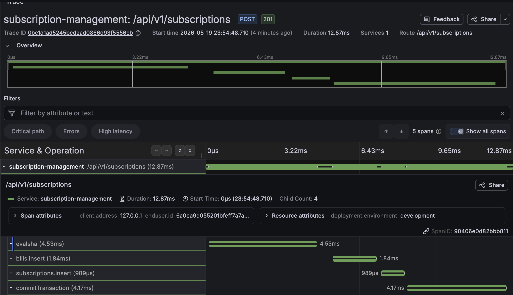
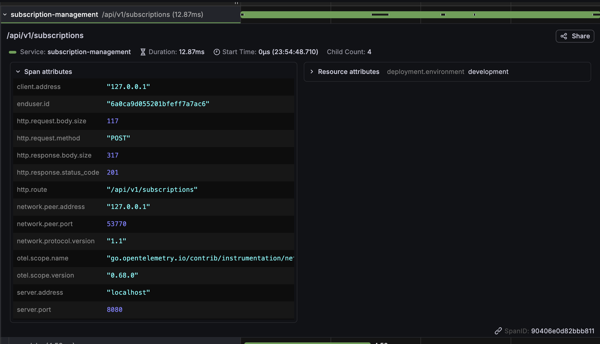
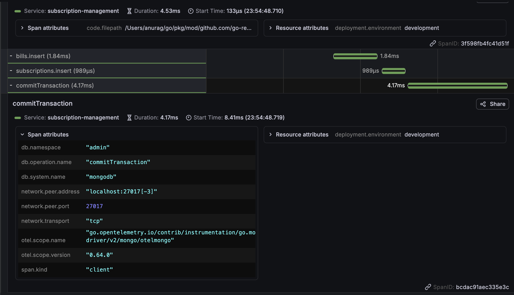
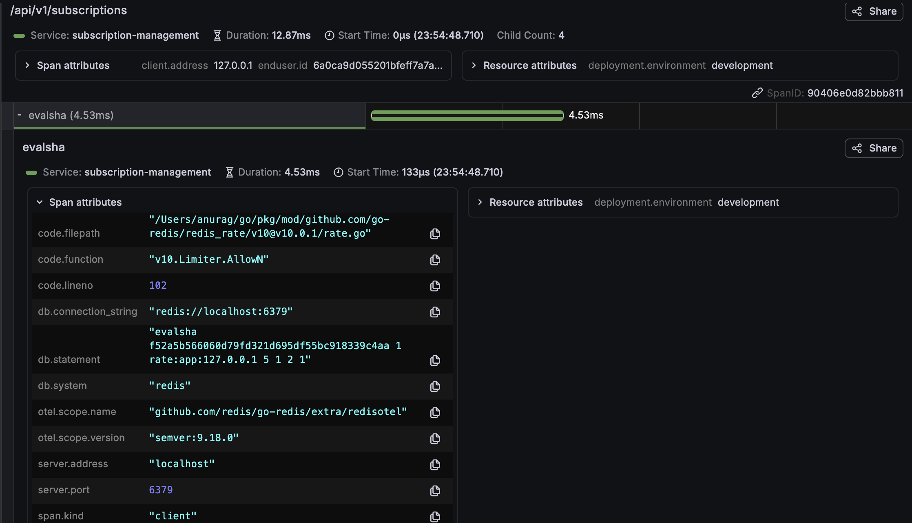

# Observability

This document covers the full observability stack — distributed tracing, metrics, structured logging, and how they're wired into the service without polluting domain logic.

---

## Stack Overview

| Tool | Role | Access |
|---|---|---|
| **Jaeger** | Distributed tracing (OTLP gRPC) | `http://localhost:16686` |
| **Prometheus** | Metrics collection (pull-based scrape) | `http://localhost:9090` |
| **Loki** | Log aggregation | `http://localhost:3100` |
| **Promtail** | Log shipper (file → Loki) | — |
| **Grafana** | Unified dashboards | `http://localhost:3000` |

All components run via a single Docker Compose file:

```bash
docker compose -f docker-compose.observability.yml up -d
```

The application exposes a `/metrics` endpoint for Prometheus scraping — this is always available regardless of whether OTel tracing is enabled.

Logs use a **file-first shipping model**: the application writes structured JSON logs to files, and Promtail tails those files and ships them to Loki. If the observability stack crashes or restarts, the log files persist on disk — nothing is lost. Once Promtail recovers, it resumes from where it left off.

---

## Distributed Tracing

### How Traces Propagate

Trace context flows through the entire request lifecycle without the domain layer ever importing OpenTelemetry:

```
HTTP Request
  │
  ├── otelhttp middleware (creates root span)
  │     ├── redisotel (rate limiter span)
  │     ├── otelmongo (bill insert span)
  │     ├── otelmongo (subscription insert span)
  │     └── otelmongo (commitTransaction span)
  │
  └── Response
```

**Instrumentation boundaries:**

| Layer | How It's Instrumented | OTel Import? |
|---|---|---|
| HTTP handler | [`otelhttp.NewHandler`](../internal/api/middlewares/otel.go) via chi middleware | Middleware only |
| Redis | [`redisotel`](https://github.com/redis/go-redis/tree/master/extra/redisotel) hook on the client | Config only ([`config/helper.go`](../internal/config/helper.go)) |
| MongoDB | [`otelmongo`](https://pkg.go.dev/go.opentelemetry.io/contrib/instrumentation/go.mongodb.org/mongo-driver/v2/mongo/otelmongo) monitor on the client | Config only ([`config/helper.go`](../internal/config/helper.go)) |
| Domain services | **None** — context propagation via `context.Context` | ❌ |
| Scheduler | Manual spans via `otel.Tracer` | Scheduler package |
| Queue worker | `AsynqTracingMiddleware` extracts trace from task headers | Observability package |
| Email sender | Manual spans via `otel.Tracer` | Notifications package |

The key design decision: **domain services never import OTel**. They receive `context.Context` and pass it through. The instrumentation libraries (`otelmongo`, `redisotel`) intercept the context at the driver level and create child spans automatically.

### Trace Walkthrough

Here's a real trace from a `POST /api/v1/subscriptions` request, captured in Jaeger:

#### Full Trace Overview

<p align="center">
  
</p>

*A single subscription creation request produces 5 spans: the root HTTP span, the Redis rate-limit check (`evalsha`), two MongoDB inserts (bill + subscription), and the transaction commit. Total: 12.87ms.*

#### Root Span Attributes

<p align="center">
  
</p>

*The root span carries OpenTelemetry semantic conventions: `http.route` (resolved from chi's route pattern), `enduser.id` (the authenticated user's ID), `deployment.environment`, HTTP method, status code, and body sizes. The `http.route` attribute is set **after** chi resolves the pattern, not at span creation — this is handled by the custom [`resolveRoutePattern`](../internal/api/middlewares/otel.go) logic.*

#### MongoDB Transaction Spans

<p align="center">
  
</p>

*The `otelmongo` instrumentation creates child spans for each MongoDB operation. The `commitTransaction` span (4.17ms) includes `db.system: mongodb`, `db.operation.name: commitTransaction`, and the server address. These spans are created automatically by the driver monitor — no manual instrumentation in the repository code.*

#### Redis Rate Limiter Span

<p align="center">
  
</p>

*The `redisotel` hook creates a span for the `evalsha` command — this is the Redis rate limiter executing its Lua script. The span attributes include `db.system: redis`, the full `db.statement` (showing the script hash and rate-limit parameters like `rate:app:127.0.0.1 5 1 2 1`), and the server address.*

---

## Trace Context Across Queues

The scheduler enqueues Asynq tasks with W3C trace context headers, allowing the worker to continue the same trace:

### Producer Side (Scheduler)

```go
// Serialize the current trace context into a string map
headers := observability.InjectIntoTaskHeaders(ctx)

// Create the task with headers attached
task := asynq.NewTaskWithHeaders(ReminderTask, payloadBytes, headers)
```

[`InjectIntoTaskHeaders`](../internal/observability/asynq.go) uses the OTel `TextMapPropagator` to serialize the `traceparent` and `tracestate` headers into the task metadata.

### Consumer Side (Worker)

```go
func AsynqTracingMiddleware(serviceName string) asynq.MiddlewareFunc {
    return func(next asynq.Handler) asynq.Handler {
        return asynq.HandlerFunc(func(ctx context.Context, task *asynq.Task) error {
            // Deserialize W3C headers back into the context
            headers := task.Headers()
            carrier := propagation.MapCarrier(headers)
            ctx = otel.GetTextMapPropagator().Extract(ctx, carrier)

            // Start a child span under the extracted parent
            ctx, span := tracer.Start(ctx, "Worker Process "+task.Type(),
                trace.WithSpanKind(trace.SpanKindConsumer),
            )
            defer span.End()

            return next.ProcessTask(ctx, task)
        })
    }
}
```

The result: a single Jaeger trace shows the full lifecycle — scheduler tick → task enqueue → Redis queue → worker pickup → MongoDB operations → email send.

---

## Metrics

### Business Metrics

Three business metrics are exposed via the OTel Prometheus exporter:

| Metric | Type | Description |
|---|---|---|
| `subscriptions_created_total` | Counter | Incremented on each successful subscription creation |
| `subscriptions_canceled_total` | Counter | Incremented on each successful cancellation |
| `active_subscriptions_total` | Observable Gauge | Queries MongoDB on each Prometheus scrape |

The metric names and descriptions are configurable via YAML:

```yaml
otel:
  metrics:
    subscriptions_created_count:
      name: "subscriptions_created_total"
      description: "Total number of successfully created subscriptions"
```

#### Suppressed Tracing for Gauge Callbacks

The `active_subscriptions_total` gauge runs a MongoDB query on every Prometheus scrape. Without intervention, `otelmongo` would create a span for each scrape — polluting the trace view with noise.

The solution is [`withSuppressedTracing`](../internal/observability/metrics.go):

```go
func withSuppressedTracing(ctx context.Context) context.Context {
    var tid trace.TraceID
    tid[15] = 1  // non-zero → IsValid()
    var sid trace.SpanID
    sid[7] = 1
    sc := trace.NewSpanContext(trace.SpanContextConfig{
        TraceID:    tid,
        SpanID:     sid,
        TraceFlags: 0,     // NOT sampled
        Remote:     true,
    })
    return trace.ContextWithRemoteSpanContext(ctx, sc)
}
```

This injects a valid but **non-sampled** remote span context. The `ParentBased` sampler sees it as a child of a dropped trace and suppresses all downstream spans — no configuration changes needed.

### Queue Metrics

Queue depth is exposed as an observable gauge with state breakdown:

| Metric | Labels | Description |
|---|---|---|
| `worker.queue.depth` | `messaging.system=asynq`, `messaging.destination.name={queue}`, `state={completed\|active\|pending\|scheduled\|retry\|archived}` | Current number of tasks in each state |

Additionally, the worker middleware tracks per-task metrics:

| Metric | Type | Description |
|---|---|---|
| `worker.task.duration_seconds` | Histogram | Execution time of each background task |
| `worker.task.total` | Counter | Total tasks processed, labeled by task type and status |

---

## Structured Logging

### Trace-Correlated Logs

A custom [`traceHandler`](../internal/observability/log_handler.go) wraps the standard `slog.Handler` to automatically inject trace context into every log record:

```go
func (h *traceHandler) Handle(ctx context.Context, record slog.Record) error {
    record = record.Clone()

    // Inject business context from appctx
    if userID, ok := appctx.GetUserID(ctx); ok {
        record.AddAttrs(logattr.UserID(userID))
    }
    if subscriptionID, ok := appctx.GetSubscriptionID(ctx); ok {
        record.AddAttrs(logattr.SubscriptionID(subscriptionID))
    }

    // Inject OTel trace/span IDs
    spanCtx := trace.SpanContextFromContext(ctx)
    if spanCtx.IsValid() {
        record.AddAttrs(
            logattr.TraceID(spanCtx.TraceID().String()),
            logattr.SpanID(spanCtx.SpanID().String()),
        )
    }

    return h.inner.Handle(ctx, record)
}
```

This means every `slog.InfoContext(ctx, "...")` call automatically gets `trace_id`, `span_id`, `user_id`, and `subscription_id` attributes — without the caller having to pass them explicitly.

For background tasks, the handler also injects `task_type` and `task_id` from the Asynq context.

### Log Attribute Packages

Two packages provide type-safe, consistent log and trace attributes:

| Package | Purpose | Example |
|---|---|---|
| [`core/logattr`](../internal/core/logattr/) | `slog.Attr` factories for structured logging | `logattr.UserID("abc")` → `slog.String("user_id", "abc")` |
| [`core/otelattr`](../internal/core/otelattr/) | OTel `attribute.KeyValue` factories for spans | `otelattr.TaskType("renewal")` → OTel attribute |

These ensure consistent key naming across logs and traces — `user_id` in logs matches `enduser.id` in spans.

### Context Enrichment

The [`observability.EnrichContext`](../internal/observability/context.go) function attaches business entity IDs to both the Go context (for logs) and the active OTel span (for traces):

```go
func EnrichContext(ctx context.Context, userID, subscriptionID string) context.Context {
    ctx = appctx.WithUserID(ctx, userID)
    ctx = appctx.WithSubscriptionID(ctx, subscriptionID)
    return ctx
}

func EnrichSpan(ctx context.Context) {
    span := trace.SpanFromContext(ctx)
    if userID, ok := appctx.GetUserID(ctx); ok {
        span.SetAttributes(semconv.EnduserID(userID))
    }
    // ...
}
```

This is called in the scheduler and worker handlers to ensure every span and log line in a background task's lifecycle carries the relevant business IDs.

---

## OTel Initialization — [`internal/observability/otel.go`](../internal/observability/otel.go)

The [`Provider`](../internal/observability/otel.go) struct wraps both the tracer and meter providers:

| Component | Configuration |
|---|---|
| **Trace exporter** | OTLP gRPC → Jaeger (configurable endpoint) |
| **Trace provider** | Batched exporter with service name + environment resource attributes |
| **Propagator** | W3C `TraceContext` + `Baggage` (composite) |
| **Metrics exporter** | Prometheus pull-based (exposed via `/metrics` endpoint) |
| **Meter provider** | Prometheus reader with service name resource |

The provider implements `CleanupHandler` for graceful shutdown — it flushes pending traces and metrics before the process exits.

When `otel.enabled: false` in the config, initialization is skipped entirely and a no-op metrics adapter is used. No conditional checks needed in the business logic.

---

## Running the Observability Stack

```bash
# Start all observability components
docker compose -f docker-compose.observability.yml up -d
```

| Service | Port | URL |
|---|---|---|
| Jaeger UI | 16686 | http://localhost:16686 |
| Jaeger OTLP gRPC | 4317 | (application connects here) |
| Prometheus | 9090 | http://localhost:9090 |
| Loki | 3100 | http://localhost:3100 |
| Grafana | 3000 | http://localhost:3000 |

Grafana is pre-configured with datasources for Prometheus, Loki, and Jaeger. Dashboards are provisioned from [`observability/grafana/dashboards/`](../observability/grafana/dashboards/).

To enable tracing in the application, set `otel.enabled: true` in your `config.yaml`:

```yaml
otel:
  enabled: true
  service_name: "subscription-management"
  jaeger_endpoint: "localhost:4317"
```
